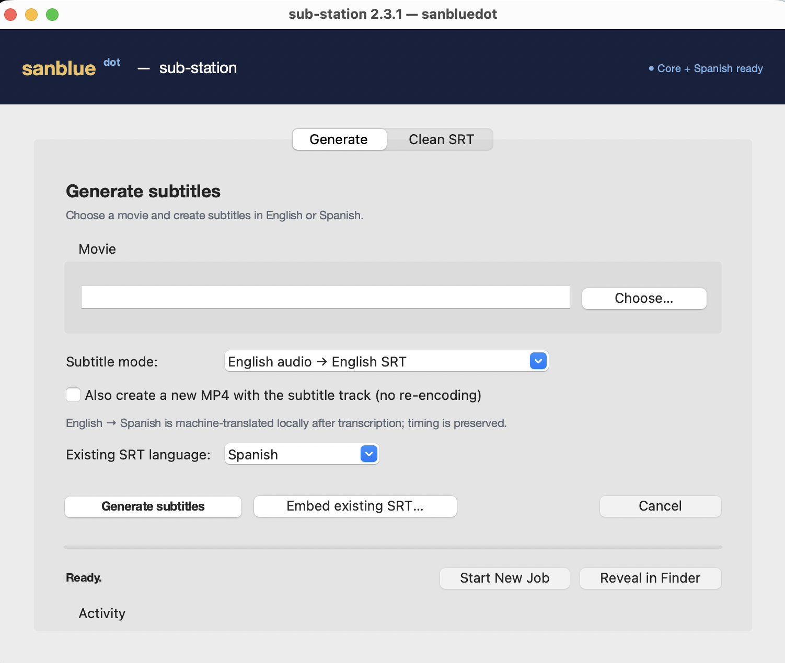

# sanblueᵈᵒᵗ sub-station

*retro dev-station — by Sandy E. Quintero*

**sub-station 2.3.1** is a fully local subtitle studio for Apple Silicon Macs.
It generates a timed SubRip file from a movie's own audio, can translate English
dialogue to Spanish, validates the result, and can add it to a new MP4 without
re-encoding the source video or audio.



Using the movie audio avoids the edition and release mismatches common in
downloaded subtitles. Whisper still estimates timestamps, so occasional dialogue
or end-credit cues can need manual correction.

## Language support

The desktop app exposes three explicit modes:

- English audio → English `.srt` (`--language en`, default).
- Spanish audio → Spanish `.srt` (`--language es`).
- English audio → English `.srt` plus Spanish `*-es.srt`
  (`--language en --translate-es`).

The third mode transcribes with Whisper first, then translates each cue locally with
`Helsinki-NLP/opus-mt-en-es`. It preserves the English SRT and its timestamps. Long
multi-sentence cues are translated sentence by sentence so text is not silently truncated.
A conservative terminology pass favors neutral Latin American forms such as `computador`,
`celular`, `auto`, `jugo` and `papa`. Ambiguous words such as `móvil` and `coche` are changed
only when the English source establishes phone, car or stroller context. Common Spain discourse
and plural forms are neutralized as well. This is still machine translation, so names, idioms,
overlapping dialogue and errors already present in the English transcript need review.

## Pipeline

```text
movie → mlx_whisper → validated English SRT → optional local Spanish translation
                                  └──────────→ optional ffmpeg embed → new *-subbed.mp4
```

- Processing stays local after the Whisper and translation models have each been
  downloaded once. Movie audio and subtitle text are not sent to an API.
- Generated and cleaned files use same-folder temporary outputs and exclusive atomic
  publication. A file that appears at the destination during a job is never overwritten.
- The source movie and downloaded SRT are never overwritten.
- Failed or cancelled jobs remove partial outputs, including a cancellation received just
  before final publication.
- If embedding fails after transcription, the completed SRT remains available.
- The cleaner rejects malformed SRT input instead of writing an empty success file.

## Desktop app

Build the app (see **Build the macOS app** below), then open
`dist/sub-station.app`, choose a movie, select the subtitle mode, and click
**Generate subtitles**. The app provides:

- readiness for `mlx_whisper`, `ffmpeg` and the optional local Spanish translator;
- stage-specific status and an in-app activity log;
- safe cancellation;
- **Start New Job**, which resets the form without deleting completed files;
- optional MP4 embedding;
- recovery through **Embed existing SRT…**;
- an explicit language selector for an existing SRT before embedding;
- **Reveal in Finder** after successful or partial output;
- a separate validated SRT cleaner;
- a permanently visible activity area and repetition warnings for manual review.

The first transcription can download the Whisper model (~1.6 GB). The Spanish model
is prepared separately once (~894 MB). The packaged app includes Python
and Tk, but uses the dedicated Whisper environment and `ffmpeg` installation.

## Command line

```bash
# English audio → English SRT
python3 substation.py "Movie.mkv"

# Spanish audio → Spanish SRT
python3 substation.py "Pelicula.mkv" --language es

# English audio → English SRT + Spanish *-es.srt + Spanish subtitle track
python3 substation.py "Movie.mkv" --translate-es --embed
```

## Requirements

- Apple Silicon Mac.
- `ffmpeg` installed with Homebrew.
- `mlx_whisper` installed in `~/miniconda3/envs/whisper`.
- `transformers<5`, `sentencepiece` and `sacremoses` installed in that same
  environment for English-to-Spanish translation.
- Python 3.12 with Tk for development; recent Homebrew Python 3.14 builds do not
  include `_tkinter`.

Confirm the development interpreter before launching:

```bash
python3.12 -m tkinter
python3.12 substation_gui.py
```

One-time Spanish translator setup:

```bash
~/miniconda3/envs/whisper/bin/python -m pip install 'transformers<5' sentencepiece sacremoses
~/miniconda3/envs/whisper/bin/python translation_worker.py --download
```

The translator is the Apache-2.0 licensed
[`Helsinki-NLP/opus-mt-en-es`](https://huggingface.co/Helsinki-NLP/opus-mt-en-es)
model. Normal app runs force local cached-model loading.

## Tests

The deterministic parser, output-safety, translation, cancellation and failure paths
have a standard-library regression suite:

```bash
python3.12 -m unittest discover -s tests -v
```

A full release check still requires one real movie transcription and `ffprobe` on
an embedded output.

## Build the macOS app

Use a pinned Python 3.12 environment carrying PyInstaller 6.21:

```bash
~/miniconda3/envs/<build-env>/bin/pyinstaller --clean --noconfirm sub-station.spec
```

The spec sets version `2.3.1`, bundle identifier `com.sanbluedot.substation`, and
uses the approved original sanblueᵈᵒᵗ artwork as the macOS icon. The current build
remains for personal/local use; public distribution additionally requires Developer
ID signing and notarization.

## Known limits

- Whisper subtitles recognized speech and may also capture sung lyrics. It does not add
  sound-effect cues or speaker labels.
- Impossible cues shorter than 80 ms are removed. Repeated short phrases are reported but
  not deleted automatically, because the same pattern can be real dialogue, chants or lyrics.
- A repeated phrase can still remain over music-only end credits; inspect reported warnings.
- MP4 embedding copies the original streams; a codec that the MP4 container rejects
  produces a clear error while preserving the SRT.
- English-to-Spanish favors neutral Latin American terminology but is not a professional
  localization pass. Incorrect English recognition cannot be repaired reliably by translation.
- No batch processing yet.

---

**sanblueᵈᵒᵗ** — retro dev-station · © 2026 Sandy E. Quintero

Released under the MIT License — see [LICENSE](LICENSE).
